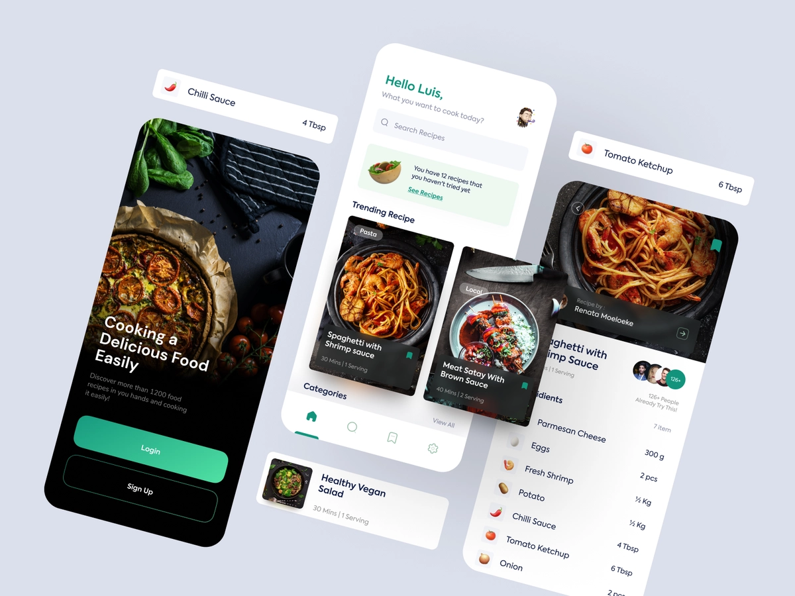

# FoodApp

App made using React Native.  
I started to made this app to learn some new concepts of ReactNative and Javascript

---

## Design

Design is made by [**Herdetya Priambodo**](https://dribbble.com/herdetya) from dribbble.com  
[_App design_](https://dribbble.com/shots/15295362-Food-Recipe-App)

---

## Built with

- [React Native](https://reactnative.dev) - The programming language used
- CLI - Expo
- Additional Dependencies:
  - @react-navigation/native
  - react-native-reanimated
  - react-native-gesture-handler
  - react-native-screens
  - react-native-safe-area-context
  - @react-native-community/masked-view
  - @react-navigation/stack
  - @react-navigation/bottom-tabs
  - expo-blur
  - expo-app-loading

---

## Authors

- **Jakub Hricik** - [LinkedIn Profile](https://www.linkedin.com/in/jakub-hricik-b17a26179?lipi=urn%3Ali%3Apage%3Ad_flagship3_profile_view_base_contact_details%3BHdP6dU0mT2msrog2g0i92g%3D%3D) - code

- **Herdetya Priambodo** - [dribbble Profile](https://dribbble.com/herdetya) - design
